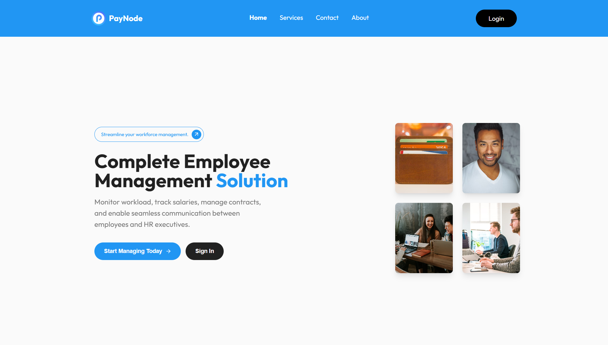
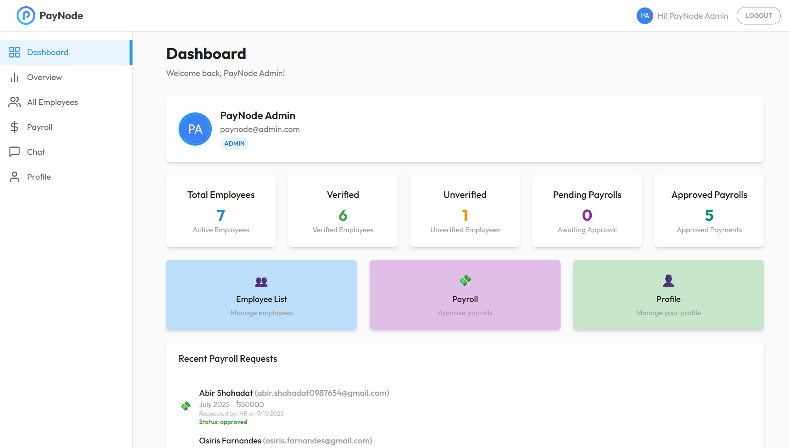

<div align="center">

# 💼💸 Paynode

**Modern Employee Management & Payroll Platform**

_Empowering organizations with seamless HR, payroll, and analytics solutions._

[](https://paynode-2025.web.app/)
[](https://react.dev/)
[](https://vitejs.dev/)
[](https://tailwindcss.com/)
[](https://firebase.google.com/)
[](https://stripe.com/)
[](https://nodejs.org/)
[](https://expressjs.com/)
[](https://mongodb.com/)
[](https://vercel.com/)


</div>

---

## 📖 About Paynode

Paynode is a comprehensive employee management and payroll platform built with modern web technologies. It streamlines HR operations, automates payroll, and empowers teams with real-time analytics, secure communication, and role-based dashboards for Admins, HR, and Employees.

---

## 📸 Screenshots

<table>
  <tr>
    <td align="center"><b>Homepage</b></td>
    <td align="center"><b>Dashboard</b></td>
  </tr>
  <tr>
    <td></td>
    <td></td>
  </tr>
</table>

---

## ✨ Core Features

1. 🛡️ **Role-Based Access Control**  
   Separate dashboards for Admin, HR, and Employees

2. 👑 **Admin Dashboard**  
   - Manage employees 👥  
   - Process payroll 💸  
   - System-wide analytics 📊  
   - Employee lists 📋

3. 🧑‍💼 **HR Dashboard**  
   - Track progress 📈  
   - Manage details 🗂️  
   - Monitor tasks ✅  
   - Performance reports 📝

4. 👷 **Employee Dashboard**  
   - Submit timesheets ⏱️  
   - Payment history 💵  
   - Profile updates 🖼️  
   - Task tracking 📅

5. 🔐 **Authentication**  
   - Secure login/registration 🔑  
   - Google Sign-In 🟦  
   - Role-based route protection 🛡️

6. 💸 **Payment Processing**  
   - Stripe integration 💳  
   - Payment history 🧾  
   - Secure transactions 🔒

7. 💬 **Real-time Communication**  
   - Built-in chat 💬  
   - Instant messaging ⚡

8. 🛎️ **Service Management**  
   - Service catalog 📚  
   - Detailed pages 📄  
   - Categorization 🏷️

9. 📊 **Data Visualization**  
   - Interactive charts 📈  
   - Performance metrics 📏  
   - Dashboard analytics 📉

10. 📱 **Responsive UI**  
    - Mobile-friendly 📲  
    - Tailwind CSS 🎨  
    - Lottie animations 🎞️

---

## 🌐 Live Demo

**🚀 Try Paynode:** [https://paynode-2025.web.app/](https://paynode-2025.web.app/)

**Admin Credentials:**  
📧 `paynode@admin.com`  
🔑 `Paynode.admin`

---

## 🛠️ Client Technology Stack

| Technology          | Purpose                     |
| ------------------- | --------------------------- |
| **React**           | Modern UI library           |
| **Vite**            | Lightning-fast build tool   |
| **Tailwind CSS**    | Utility-first CSS framework |
| **Firebase**        | Auth & Hosting              |
| **Stripe**          | Payment processing          |
| **React Query**     | Data fetching & caching     |
| **React Router**    | Client-side routing         |
| **SweetAlert2**     | Beautiful alerts            |
| **React Hot Toast** | Notifications               |
| **Lottie**          | Animations                  |

## 🛠️ Server Technology Stack

| Technology         | Purpose                            |
| ------------------ | ---------------------------------- |
| **Node.js**        | JavaScript runtime environment     |
| **Express**        | Web application framework          |
| **MongoDB**        | NoSQL database for data storage    |
| **Firebase Admin** | Authentication and user management |
| **Stripe**         | Payment gateway integration        |
| **Vercel**         | Cloud deployment                   |
| **dotenv**         | Environment variable management    |
| **ESLint**         | Code linting and quality           |
| **CORS**           | Cross-origin resource sharing      |
| **Axios**          | HTTP client for API calls          |

**🔗 Server Repository:**  
[https://github.com/Purab2001/Paynode_server](https://github.com/Purab2001/Paynode_server)

---

## ⚡ Quick Start

### 📋 Prerequisites

- Node.js (v18 or higher)
- npm

### 🚀 Installation

1. **Clone the Repository**
   ```bash
   git clone https://github.com/B11_A12/paynode_client.git
   cd paynode_client
   ```
2. **Install Dependencies**
   ```bash
   npm install
   ```
3. **Start the Development Server**
   ```bash
   npm run dev
   ```
4. **Build for Production**
   ```bash
   npm run build
   ```

---

## 🚀 Deployment

1. **Install Firebase CLI:**
   ```bash
   npm install -g firebase-tools
   ```
2. **Login to Firebase:**
   ```bash
   firebase login
   ```
3. **Deploy to Firebase Hosting:**
   ```bash
   firebase deploy
   ```

---
